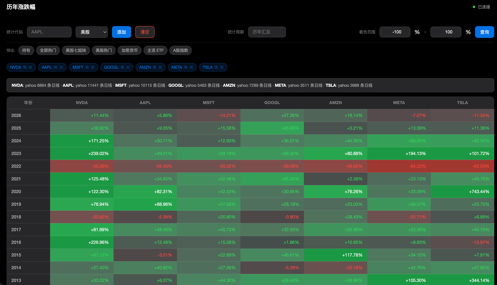
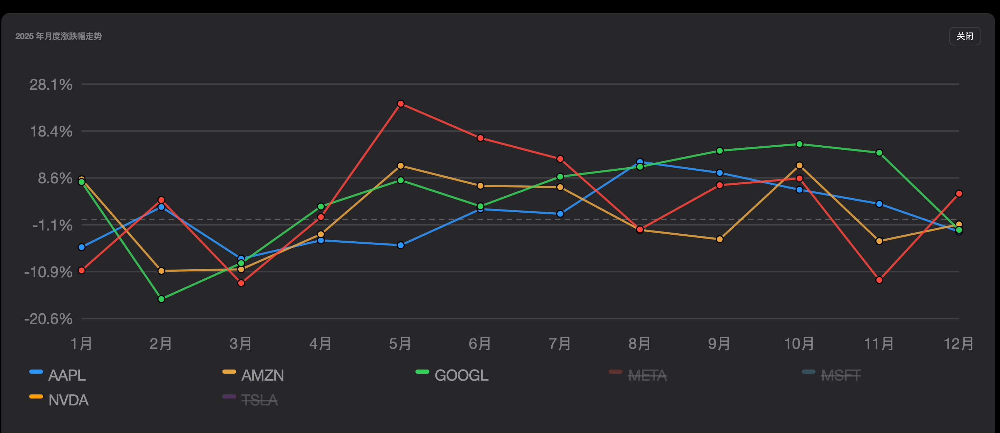
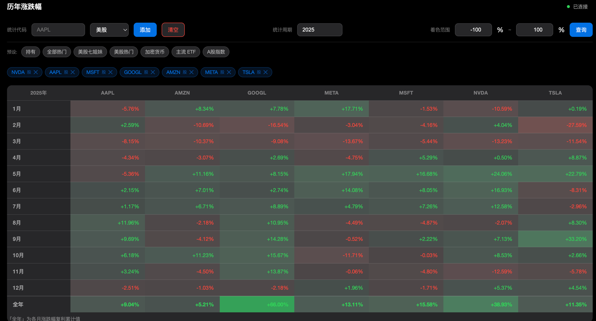
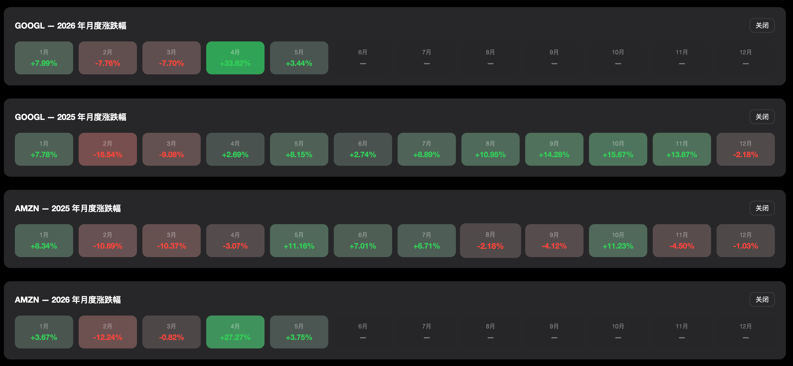
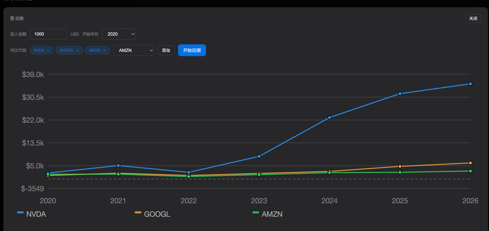
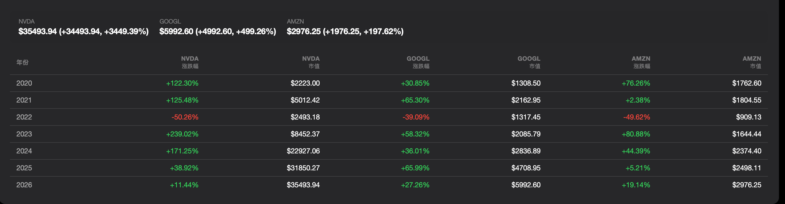

# GlobalAssetHistory — 历年涨跌幅

> 跨资产类别（美股、数字货币、A 股）的历史收益查询工具。支持历年汇总与指定年份月度涨跌幅分析。

## 截图

### 历年涨跌幅热力图


### 年度走势折线图


### 指定年份月度涨跌幅


### 月度走势折线图


### 回测分析


### 回测明细


## 功能

- **历年汇总** — 多资产历年涨跌幅热力图，HSL 颜色渐变直观反映涨跌幅度
- **指定年份** — 选择或输入任意年份，查看 1~12 月各月涨跌幅 + 全年复利累计
- **月度趋势图** — 选中年份后折线图展示全年走势，支持图例交互（点击隐藏/显示、悬停高亮）
- **预设组合** — 一键加载常用资产组（主流币、美股七姐妹、A 股指数等），配置文件自定义
- **着色范围** — 自定义热力图颜色映射区间，适应不同波动率的资产
- **回测** — 模拟给定起始年份的年度复利增长，多资产对比 + 市值走势图

### 数据源

| 类型 | 数据源 | 备注 |
|------|--------|------|
| 美股 | Yahoo Finance | 自动使用 adjclose（含股息修正） |
| 数字货币 | Binance → OKX → CoinGecko | 三级自动 fallback |
| A 股 | East Money | 上证/深证/创业板指数 |

## 快速开始

```bash
./start.sh
```

首次运行自动创建虚拟环境并安装依赖。默认监听 `http://127.0.0.1:8730`。

## 使用方式

### 交互式菜单

```bash
./start.sh
```

```
请选择操作:
  1. 启动服务
  2. 停止服务
  3. 重启服务
  4. 查看状态
  5. 退出
```

选择"启动服务"后进一步选择启动模式：

```
请选择启动模式:
  1. debug    (前台，自动重载)
  2. production (后台运行)
  3. 取消
```

### 命令模式

| 命令 | 说明 |
|------|------|
| `./start.sh` | 交互式菜单 |
| `./start.sh start` | 生产模式（后台运行） |
| `./start.sh debug` | 调试模式（前台，自动重载） |
| `./start.sh stop` | 停止后台服务 |
| `./start.sh restart` | 重启服务 |
| `./start.sh status` | 查看服务状态 |

### 端口配置

```bash
PORT=8080 ./start.sh start
```

## 配置

`backend/config/price_change_config.json` 可自定义：

- **presets** — 预设资产组（label + symbols），一键加载
- **color_range** — 着色范围（min/max）
- **crypto.coin_ids** — 币种 → CoinGecko ID 映射

示例：

```json
{
  "presets": {
    "my_portfolio": {
      "label": "我的持仓",
      "symbols": [
        { "symbol": "AAPL", "type": "stock", "name": "Apple" },
        { "symbol": "BTC", "type": "crypto" }
      ]
    }
  }
}
```

## API 文档

所有接口位于 `http://127.0.0.1:8730/api/price-change/`。

| 方法 | 路径 | 说明 |
|------|------|------|
| GET | `/api/price-change/config` | 获取预设和着色范围配置 |
| POST | `/api/price-change/yearly` | 获取多资产的历年涨跌幅 |
| POST | `/api/price-change/monthly` | 获取单个资产指定年份的月度涨跌幅 |
| POST | `/api/price-change/monthly-batch` | 获取多资产指定年份的月度涨跌幅 |
| GET | `/api/health` | 健康检查 |

### POST /api/price-change/yearly

请求：
```json
{
  "symbols": [
    { "symbol": "BTC", "type": "crypto" },
    { "symbol": "AAPL", "type": "stock" }
  ]
}
```

响应：
```json
{
  "years": ["2025", "2024", "2023"],
  "data": {
    "BTC": { "2025": 45.2, "2024": 130.5 },
    "AAPL": { "2025": 18.3, "2024": -5.2 }
  },
  "meta": {
    "BTC": { "source": "binance", "points": 4380, "error": null }
  }
}
```

### POST /api/price-change/monthly-batch

请求：
```json
{
  "symbols": [{ "symbol": "BTC", "type": "crypto" }],
  "year": 2025
}
```

响应：
```json
{
  "year": 2025,
  "data": {
    "BTC": [
      { "month": 1, "return": 12.5 },
      { "month": 2, "return": -3.2 }
    ]
  }
}
```

## 项目结构

```
├── start.sh                        # 启动脚本（菜单 + 命令模式）
├── .gitignore
├── README.md
├── doc/screenshot/                 # 截图
├── backend/
│   ├── app.py                      # Flask 入口（API + 静态文件托管）
│   ├── requirements.txt
│   ├── config/
│   │   └── price_change_config.json  # 预设与币种映射
│   ├── routes/
│   │   └── price_change.py         # API 路由
│   └── service/
│       └── price_change/
│           └── price_change_service.py  # 核心业务逻辑
└── frontend/
    ├── price-change.html           # 主页面
    ├── css/app.css                 # Apple 风格样式
    └── js/price-change.js          # 前端逻辑
```

## 技术栈

| 层 | 技术 |
|----|------|
| 后端 | Python 3 + Flask |
| 前端 | 原生 HTML / CSS / JS |
| 图表 | SVG（手工渲染，无第三方图表库依赖） |
| 数据获取 | requests, yfinance（可选） |

## License

MIT
